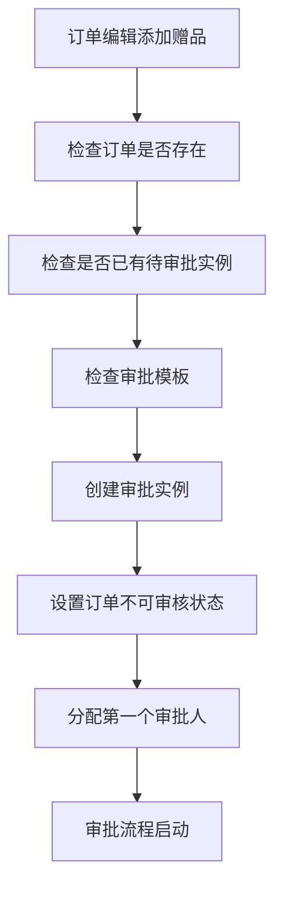
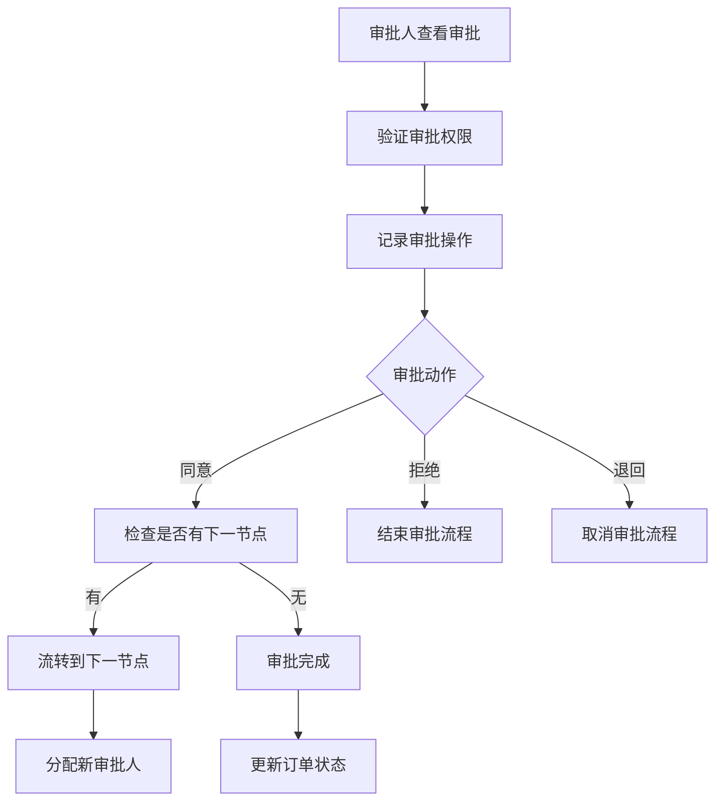

# 订单赠品审批流程实现总结

## 实现概述

本次开发完成了订单编辑添加赠品后的审批流程业务逻辑，包括完整的审批流程管理、状态跟踪、记录管理等功能。

## 核心功能模块

### 1. 审批流实例控制器 (`ticket_ctl_admin_workflow_case`)

**主要功能：**
- 审批实例列表管理
- 审批页面展示
- 审批处理逻辑
- 审批流程详情查看
- 取消和重新提交审批
- 导出审批记录

**关键方法：**
- `audit($id)` - 审批页面
- `do_audit()` - 处理审批
- `create_gift_approval()` - 创建赠品审批实例
- `detail($id)` - 审批详情
- `cancel_approval()` - 取消审批
- `resubmit_approval()` - 重新提交审批

### 2. 审批流业务逻辑类 (`ticket_workflow_case`)

**主要功能：**
- 数据验证和保存
- 审批流程处理
- 节点流转管理
- 审批记录管理
- 订单状态更新

**关键方法：**
- `checkAuditParams()` - 验证审批参数
- `processAudit()` - 处理审批流程
- `createGiftApprovalCase()` - 创建赠品审批实例
- `getNextNode()` - 获取下一个审批节点
- `getApprovalRecords()` - 获取审批记录

### 3. 订单赠品审批服务类 (`ticket_service_order_gift_approval`)

**主要功能：**
- 触发审批流程
- 检查审批状态
- 批量处理
- 统计分析
- 自动审批

**关键方法：**
- `triggerGiftApproval()` - 触发赠品审批
- `checkOrderApprovalRequired()` - 检查订单是否需要审批
- `getOrderApprovalStatus()` - 获取订单审批状态
- `getUserPendingApprovals()` - 获取用户待审批列表
- `getApprovalStatistics()` - 获取审批统计

### 4. 订单赠品管理控制器 (`ticket_ctl_admin_order_gift`)

**主要功能：**
- 赠品添加页面
- 审批状态查看
- 待审批列表
- 统计分析
- 批量操作

## 数据库表关系

### 核心表结构

1. **`ticket_workflow_template`** - 审批流模板表
   - 定义审批流程模板
   - 支持不同场景类型
   - 版本管理

2. **`ticket_workflow_node`** - 审批流节点表
   - 定义审批流程节点
   - 节点顺序和审批人配置
   - 支持多种审批人类型

3. **`ticket_workflow_case`** - 审批流实例表
   - 具体的审批实例
   - 关联业务单据
   - 状态跟踪

4. **`ticket_workflow_record`** - 审批记录表
   - 记录每个节点的审批结果
   - 审批意见和操作时间
   - 完整的审批轨迹

### 与订单系统的集成

- **`ome_orders`** - 订单主表
  - 通过 `is_not_combine` 字段控制订单是否可审核
  - 审批通过后恢复订单可审核状态

- **`ome_order_objects`** - 订单子单表
  - 存储赠品信息 (`obj_type = 'gift'`)
  - 关联到具体订单

- **`ome_order_items`** - 订单行明细表
  - 存储赠品的详细明细信息

## 审批流程逻辑

### 1. 创建审批实例流程



### 2. 审批处理流程



### 3. 状态流转图

```
pending → processing → approved
    ↓         ↓           ↓
  cancelled ← ← ← ← ← ← ← ←
```

## 关键业务规则

### 1. 审批权限控制
- 只有指定的审批人才能处理审批
- 提交人可以取消或重新提交审批
- 审批人不能审批自己提交的申请

### 2. 订单状态管理
- 有待审批时，订单设置为不可审核状态
- 审批通过后，恢复订单可审核状态
- 审批取消后，恢复订单可审核状态

### 3. 审批流程控制
- 支持多级审批流程
- 每个节点必须审批完成后才能进入下一节点
- 支持审批退回和取消操作

### 4. 数据完整性
- 所有审批操作都有详细记录
- 支持审批轨迹追溯
- 防止重复审批

## 扩展功能

### 1. 多级审批支持
- 支持配置多个审批节点
- 支持不同审批人类型（用户、角色、部门）
- 支持条件审批（根据订单金额等条件）

### 2. 审批统计功能
- 审批通过率统计
- 审批时效分析
- 审批人工作量统计

### 3. 审批提醒功能
- 待审批提醒
- 审批超时提醒
- 审批结果通知

### 4. 批量操作功能
- 批量检查审批状态
- 批量导出审批记录
- 批量清理过期记录

## 技术特点

### 1. 模块化设计
- 清晰的模块划分
- 松耦合的架构设计
- 易于扩展和维护

### 2. 数据安全
- 完整的权限控制
- 数据验证和校验
- 操作日志记录

### 3. 性能优化
- 合理的数据库索引
- 分页查询支持
- 缓存机制

### 4. 用户体验
- 友好的界面设计
- 清晰的状态提示
- 便捷的操作流程

## 部署和使用

### 1. 数据库配置
- 确保相关表已创建
- 配置正确的数据库连接
- 设置适当的权限

### 2. 审批模板配置
- 创建赠品审批模板
- 配置审批节点和审批人
- 设置审批流程规则

### 3. 权限配置
- 配置审批相关权限
- 设置审批人角色
- 配置操作权限

### 4. 集成测试
- 测试审批流程完整性
- 验证数据一致性
- 检查性能表现

## 总结

本次开发实现了完整的订单赠品审批流程系统，包括：

1. **完整的审批流程管理** - 从创建到完成的完整流程
2. **灵活的状态管理** - 支持多种审批状态和操作
3. **详细的记录跟踪** - 完整的审批轨迹和操作日志
4. **友好的用户界面** - 清晰的操作界面和状态显示
5. **强大的扩展能力** - 支持多种扩展功能和定制需求

该系统为订单管理提供了完善的审批控制机制，确保了业务操作的规范性和可追溯性。
